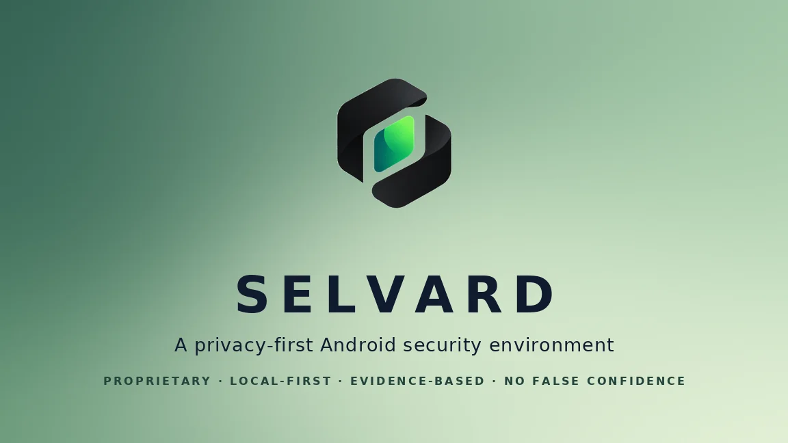
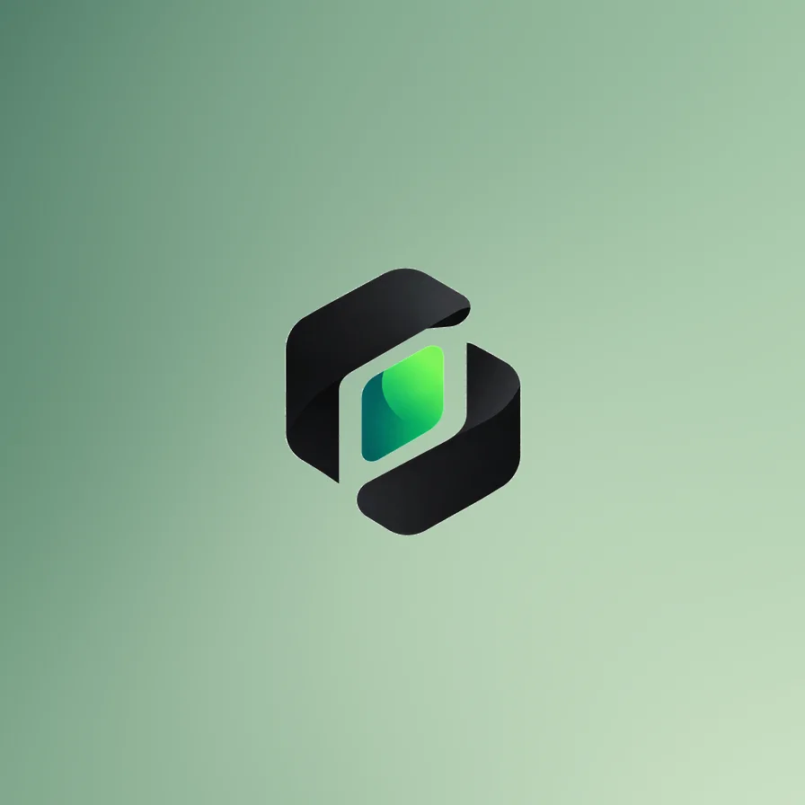

<div align="center" style="background: linear-gradient(135deg, #071f24 0%, #0b4f4a 46%, #8fe388 100%); border-radius: 22px; padding: 18px; margin: 0 auto 28px;">
  
</div>

# Selvard

**A privacy-first Android security environment** that detects, explains, contains, and correlates threats across links, applications, networks, identity, privacy activity, and device security — while preserving user control and minimizing data exposure.

*Selvard* means **the self-warden**: a guardian that never outsources your trust. Local-first by architecture, honest by contract, proprietary by design.

## Try the current build

[**Download `selvard-v0.3.0-phase7.apk` (v0.3.0, Phase 7)**](https://github.com/Khubaib7-del/MARK-42/releases/download/v0.3.0-phase7/selvard-v0.3.0-phase7.apk) — sideload on any Android 8.0+ device. Includes Link Guardian (share or paste a link), App Guardian (on-demand app inventory scan), the opt-in Network Guardian DNS filter, Privacy Monitor (install/update/remove facts, permission snapshots, boot records, device-integrity facts with honest NOT MONITORED labels), and the new Identity Exposure (consented HIBP breach checks — needs your own HIBP API key). **Includes the v0.1.1 scan-crash fix.** Debug-signed for testing; the release notes list every honest limit of this build.

## Status

**Phase 5 — App Guardian (complete).**

Three guardians are live. **Link Guardian** (Phase 3): share or paste a link and Selvard analyzes it entirely on-device — evidence-first verdicts, never "safe". **Network Guardian** (Phase 4): an opt-in, split-tunnel DNS filter — only DNS passes through; all other traffic bypasses Selvard entirely. Blocked names are refused on-device with zero egress; allowed lookups go unmodified to your device's own resolver. **App Guardian** (Phase 5): on-demand inventory of installed apps — requested permissions are manifest facts, classified against a transparent catalog with stalkerware capability-combination detection (e.g., SMS + notifications = OTP interception), installer provenance, and legacy-target-SDK findings. Grant state is never read or claimed; no result is a malware verdict. Scans record data-minimizing events: summary counts, and per-app details only for high/critical scores (capped). 80/80 unit tests, detekt and Android lint clean. All feeds are clearly-labeled **development samples**; real blocklists arrive with threat-intelligence integration.

## What Selvard is

| | |
| --- | --- |
| **It is** | A security control plane: Link Guardian, Network Guardian (local-only DNS filtering), App Guardian, Privacy Monitor, Identity Exposure, Device Integrity, Incident Timeline, Security Posture, and explainable response workflows. |
| **It is not** | An antivirus, a VPN, a "score" app, or a hacker-themed dashboard. No fake features. No "your device is safe!" theater. |

## Governing principles

1. The security system must not become the surveillance system.
2. Never fake a capability that Android does not permit.
3. Never present absence of detection as safety ("no known threat" ≠ "safe").
4. Local-first processing; the Network Guardian filters on-device and never tunnels traffic to any server.
5. Deterministic, evidence-backed decisions; AI assists explanation, never judgment.

## Documentation index

| Document | Purpose |
| --- | --- |
| `docs/PROJECT_FOUNDATION_REPORT.md` | Phase 0 summary report |
| `docs/PRD.md` | Product requirements |
| `docs/DRD.md` | Developer/design requirements |
| `docs/ARCHITECTURE.md` | System architecture |
| `docs/ROADMAP.md` | Phased roadmap (Phase 0–12) |
| `docs/security/THREAT_MODEL.md` | Threat model (categories A–T) |
| `docs/security/SECURITY_ARCHITECTURE.md` | Security architecture |
| `docs/security/PRIVACY_ARCHITECTURE.md` | Privacy architecture |
| `docs/security/DATA_CLASSIFICATION.md` | Data classes and retention |
| `docs/security/DEPENDENCY_POLICY.md` | Dependency evaluation policy |
| `docs/security/INCIDENT_RESPONSE.md` | Incident response procedures |
| `docs/security/SECURITY_TESTING.md` | Security test plan |
| `docs/research/ANDROID_CAPABILITIES.md` | Capability matrix (mandatory) |
| `docs/research/THREAT_INTELLIGENCE.md` | TI sources and provider design |
| `docs/research/MALWARE_ANALYSIS.md` | Malware analysis approach |
| `docs/research/COMPETITIVE_RESEARCH.md` | Market landscape |
| `docs/product/MVP_SCOPE.md` | MVP scope and security boundary |
| `docs/product/USER_FLOWS.md` | User flows |
| `docs/product/PROTECTED_ASSETS.md` | Protected asset model |
| `docs/brand/BRAND_IDENTITY.md` | Name, logomark, identity rules |
| `docs/decisions/` | Architecture Decision Records |

## Repository structure

```
/docs        engineering and product documentation
/assets      brand assets (logomark, banner)
/core        platform-neutral security domain (Kotlin Multiplatform) — implemented
/android     Android app (Kotlin, Jetpack Compose) — shell implemented
/backend     cloud intelligence services (minimal, deferred) — Phase 12+
/desktop     future desktop agent (not MVP) — V3
/scripts     toolchain bootstrap and build tooling
/tests       cross-cutting test assets — grows with engines
```

## Development

Requires JDK 21 and the Android SDK (platform 35, build-tools 35.0.0). Reproducible bootstrap:

```bash
scripts/bootstrap-toolchain.sh   # JDK via mise + Android SDK + local.properties
./gradlew detekt :core:domain:jvmTest :android:app:assembleDebug
```

## Brand

<div align="center" style="background: linear-gradient(135deg, #f4fff1 0%, #d6f5ce 45%, #79d68a 100%); border-radius: 22px; padding: 24px; margin: 28px auto;">
  
</div>

The primary logo (owner-supplied) is the product's visual identity: dark ink structure on a light field with a green accent family — deep teal-green for trust, bright signal green for detection. The logo should remain clear, calm, and recognizable across product surfaces.

Identity rules, palette, and the naming decision record live in `docs/brand/BRAND_IDENTITY.md` and `docs/decisions/ADR-008-naming-direction.md`.

## License

**Proprietary software — all rights reserved.** Selvard's code, documentation, and brand assets are the property of the copyright holder. No open-source license is granted. See [LICENSE](LICENSE).
