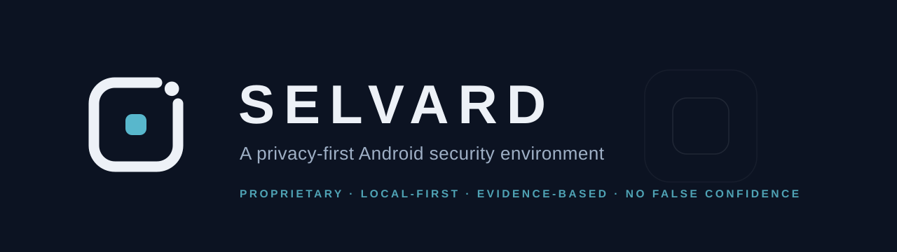

<p align="center">
  
</p>

# Selvard

**A privacy-first Android security environment** that detects, explains, contains, and correlates threats across links, applications, networks, identity, privacy activity, and device security — while keeping the user's sensitive information on the device whenever technically possible.

*Selvard* means **the self-warden**: a guardian that never outsources your trust. Local-first by architecture, honest by contract, proprietary by design.

## Status

**Phase 0 — Foundation (complete, documentation only).**

No application code exists yet. This repository currently contains the engineering foundation: threat model (20 attack categories, fully attributed), Android capability matrix (verified against platform documentation), architecture, PRD/DRD, privacy and security documentation, roadmap, and ADRs. Implementation begins only after this foundation is reviewed.

## What Selvard is

| | |
| --- | --- |
| **It is** | A security control plane: Link Guardian, Network Guardian (local-only DNS filtering), App Guardian, Privacy Monitor, Identity Exposure, Device Integrity, Incident Timeline, Security Posture — one coherent, explainable environment. |
| **It is not** | An antivirus, a VPN, a "score" app, or a hacker-themed dashboard. No fake features. No "your device is safe!" theater. |

## Governing principles

1. The security system must not become the surveillance system.
2. Never fake a capability that Android does not permit.
3. Never present absence of detection as safety ("no known threat" ≠ "safe").
4. Local-first processing; the Network Guardian filters on-device and never tunnels traffic to any server.
5. Deterministic, evidence-backed decisions; AI assists explanation, never judgment.

## Documentation index

| Document | Purpose |
| --- | --- |
| `docs/PROJECT_FOUNDATION_REPORT.md` | Phase 0 summary report |
| `docs/PRD.md` | Product requirements |
| `docs/DRD.md` | Developer/design requirements |
| `docs/ARCHITECTURE.md` | System architecture |
| `docs/ROADMAP.md` | Phased roadmap (Phase 0–12) |
| `docs/security/THREAT_MODEL.md` | Threat model (categories A–T) |
| `docs/security/SECURITY_ARCHITECTURE.md` | Security architecture |
| `docs/security/PRIVACY_ARCHITECTURE.md` | Privacy architecture |
| `docs/security/DATA_CLASSIFICATION.md` | Data classes and retention |
| `docs/security/DEPENDENCY_POLICY.md` | Dependency evaluation policy |
| `docs/security/INCIDENT_RESPONSE.md` | Incident response procedures |
| `docs/security/SECURITY_TESTING.md` | Security test plan |
| `docs/research/ANDROID_CAPABILITIES.md` | Capability matrix (mandatory) |
| `docs/research/THREAT_INTELLIGENCE.md` | TI sources and provider design |
| `docs/research/MALWARE_ANALYSIS.md` | Malware analysis approach |
| `docs/research/COMPETITIVE_RESEARCH.md` | Market landscape |
| `docs/product/MVP_SCOPE.md` | MVP scope and security boundary |
| `docs/product/USER_FLOWS.md` | User flows |
| `docs/product/PROTECTED_ASSETS.md` | Protected asset model |
| `docs/brand/BRAND_IDENTITY.md` | Name, logomark, identity rules |
| `docs/decisions/` | Architecture Decision Records |

## Repository structure

```
/docs        engineering and product documentation (Phase 0 foundation)
/assets      brand assets (logomark, banner)
/core        platform-neutral security domain (Kotlin Multiplatform) — Phase 1+
/android     Android app (Kotlin, Jetpack Compose) — Phase 1+
/backend     cloud intelligence services (minimal, deferred) — Phase 12+
/desktop     future desktop agent (not MVP) — V3
/scripts     build, CI, tooling — Phase 1+
/tests       cross-cutting test assets — Phase 1+
```

Implementation directories are created when their first phase begins.

## Brand

Logomark: the sealed boundary with one guarded gate, protecting the core — the self-warden concept rendered in geometry.

<p align="center">
  
</p>

Identity rules, palette, and the naming decision record live in `docs/brand/BRAND_IDENTITY.md` and `docs/decisions/ADR-008-naming-direction.md`.

## License

**Proprietary software — all rights reserved.** Selvard's code, documentation, and brand assets are the property of the copyright holder. No open-source license is granted. See [LICENSE](LICENSE).
