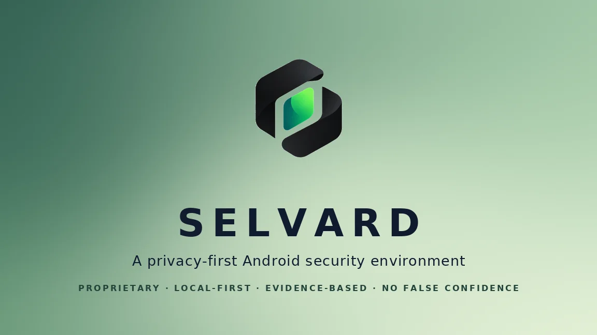
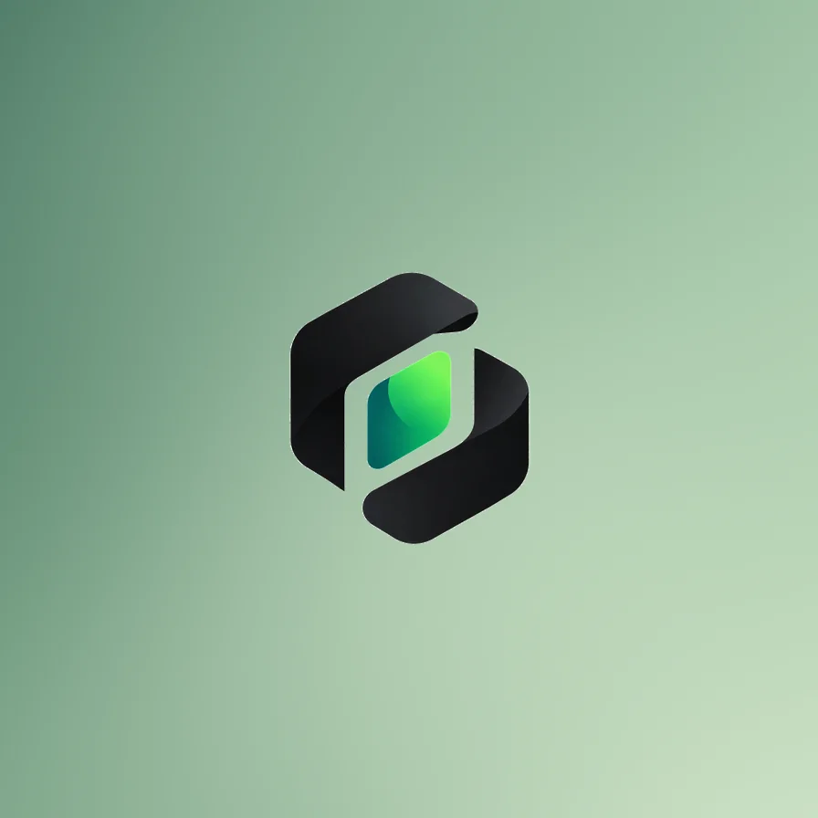

<div align="center" style="background: linear-gradient(135deg, #071f24 0%, #0b4f4a 46%, #8fe388 100%); border-radius: 24px; padding: 20px; margin: 0 auto 28px;">
  
</div>

<div align="center">

# Selvard (The Self-Warden)
**A Privacy-First, Local-First On-Device Android Security Shield**

[-brightgreen?logo=android&logoColor=white)](android/)
[](core/domain/)
[](docs/ARCHITECTURE.md)
[-success)](docs/security/PHASE11_MVP_TEST_REPORT.md)
[](config/detekt/detekt.yml)
[](docs/DRD.md)
[](LICENSE)

*Selvard* means **the self-warden**: an institutional guardian that never outsources your trust. Every threat analysis, permission audit, and link inspection happens 100% on your device.

[**⬇️ Download Latest APK**](#-download--sideload-guide) • [**✨ Key Features**](#-core-guardians) • [**⚠️ Download & Install Help**](#-install-help--troubleshooting) • [**🤝 Contributing**](CONTRIBUTING.md) • [**📜 Code of Conduct**](CODE_OF_CONDUCT.md)

</div>

---

## 💡 Why Selvard?

Traditional security and antivirus apps have become **surveillance software in disguise** — vacuuming up your browsing history, contacts, app usage, and telemetry to monetize or upload to third-party clouds.

**Selvard operates under an absolute governing principle:**
> *The security system must never become the surveillance system.*

- 🔒 **Zero Cloud Telemetry**: No Google Analytics, no telemetry SDKs, no user accounts, no tracking.
- 🛡️ **100% On-Device Processing**: DNS filtering, APK permission heuristics, and link analysis run locally on your phone.
- ⚖️ **Honest Limits**: We never claim your device is "100% Safe" (absence of evidence is not evidence of safety). We never pretend to have permissions or capabilities Android forbids.
- 💎 **Curvy Liquid-Glass Experience**: Clean, approachable, modern UI with interactive status beacons and CAD blueprint launch animations designed for human beings, not hacker consoles.

---

## 📦 Download & Sideload Guide

### Latest Release
👉 [**Download `selvard-v0.8.0-phase12.apk` (v0.8.0, Phase 12)**](https://github.com/Khubaib7-del/MARK-42/releases/download/v0.8.0-phase12/selvard-v0.8.0-phase12.apk)
- **File size**: ~10.3 MB
- **Target OS**: Android 8.0 Oreo (API 26) through Android 15 (API 35)
- **SHA-256 Checksum**: Check release assets on [GitHub Releases](https://github.com/Khubaib7-del/MARK-42/releases)

---

## 🛠️ Install Help & Troubleshooting

If you are downloading or installing on your phone, you may encounter two common Android security prompts. Here is exactly why they happen and how to proceed:

### 1. Chrome Download Stalls at 100% (10.33 MB / 10.33 MB)?
- **What happens**: When downloading an `.apk` directly from GitHub in Google Chrome Mobile, Chrome's Safe Browsing service flags new, unknown APK downloads without pre-existing domain reputation. The download circle fills completely, but Chrome pauses in `.crdownload` state.
- **How to resolve**:
  1. Open Chrome's **Downloads** menu (`⋮` > **Downloads**).
  2. If Chrome shows *"This file might be harmful"*, tap **Keep anyway** or **Download anyway**.
  3. *Alternative Browsers*: Download using **Firefox**, **Brave**, or **Opera Mobile**, which do not hold `.apk` files at 100%.
  4. *Laptop Transfer*: Download the APK on your laptop/computer and transfer it to your phone via USB or WhatsApp document sharing.

### 2. Play Protect "Blocked by Play Protect / Unknown Developer"?
- **What happens**: When installing a sideloaded APK for the first time, Android's Play Protect scanner displays a yellow warning with an exclamation mark stating: *"Unrecognized app / Play Protect doesn't recognize this app's developer"*.
- **Why this happens**: This is completely normal for pre-release software signed with developer keys before Google Play Store public distribution.
- **How to install**:
  1. Tap **"More details"** (or the small dropdown arrow below the warning).
  2. Tap **"Install anyway"**.
  3. The app will install cleanly and immediately be ready for use.

---

## 🛡️ Core Guardians

| Guardian | What It Does On-Device | What It Never Does (Honest Limits) |
| :--- | :--- | :--- |
| 🔗 **Link Guardian** | Analyzes shared/pasted URLs for typosquats, brand impersonation, punycode/IDN homoglyphs, and local threat lists. | Never intercepts in-browser clicks silently (Android forbids it; user-initiated only). |
| 🌐 **Network Guardian** | Local split-tunnel DNS filter via `VpnService`. Refuses known malware/tracker domains on-device with **zero network egress**. | Never routes your app traffic to a remote server. Never inspects encrypted HTTPS payloads. |
| 📱 **App Guardian** | On-demand inventory audit of declared permissions, dangerous stalkerware combos (e.g. SMS + Notifications), and legacy target SDKs. | Never reads other apps' internal data or granted runtime states. Results are risk signals, not malware verdicts. |
| 👁️ **Privacy Monitor** | Tracks observable system facts: package install/update/removal timelines, permission-change snapshots, and reboot timestamps. | Explicitly labels sensor use (mic/camera/GPS) as `NOT MONITORED` (Android OS owns sensor dots). |
| 🔐 **Identity Vault** | Hardware-encrypted identity vault with consented Have I Been Pwned (HIBP) k-anonymity breach queries. | Never uploads full passwords. Requires explicit per-identity consent. |
| ⏱️ **Incident Timeline** | Groups security events by temporal proximity into clear incident streams. | Never invents false causality. Uses honest *"occurred shortly after"* language. |

---

## 🏗️ Architecture & Technical Foundation

Selvard is structured strictly as a clean multi-module architecture:

```
├── core/domain      # Pure Kotlin Multiplatform domain logic (158 JVM unit tests)
│                    # Zero Android framework dependencies (no android.*)
├── android/app      # Evidence collectors, Jetpack Compose UI, Room database
├── assets/brand     # Brand identity, SVG vector marks, launcher icons
├── docs/            # Engineering architecture, PRD, DRD, and threat models
└── config/detekt    # Strict static analysis rules
```

### Verification Suite
Selvard enforces continuous verification gates across every commit:
```bash
# Run pure domain tests (158/158 passing)
.\gradlew.bat :core:domain:jvmTest

# Run static analysis (zero warnings)
.\gradlew.bat detekt

# Run Android lint
.\gradlew.bat :android:app:lintDebug

# Assemble debug APK
.\gradlew.bat :android:app:assembleDebug
```

---

## 🎨 Visual Identity & Brand

<div align="center" style="background: linear-gradient(135deg, #f4fff1 0%, #d6f5ce 45%, #79d68a 100%); border-radius: 20px; padding: 22px; margin: 24px auto;">
  
</div>

- **The Keystone Arch**: The Selvard mark represents architectural resilience: an arch stands for millennia because every stone locks every other into place, crowned by the keystone.
- **Palette**: Deep Ink (`#0C1322`), Verdant Green (`#0A6C60`), Signal Green (`#54E454`), and Stillwater Teal (`#3E8E9E`).
- Full brand specification: [`docs/brand/BRAND_IDENTITY.md`](docs/brand/BRAND_IDENTITY.md).

---

## 📄 License & Community

- **License**: Proprietary Software. All rights reserved. See [`LICENSE`](LICENSE).
- **Code of Conduct**: Contributor Covenant v2.1. See [`CODE_OF_CONDUCT.md`](CODE_OF_CONDUCT.md).
- **Contributing**: Community contribution guide and setup instructions. See [`CONTRIBUTING.md`](CONTRIBUTING.md).
- **Security Policy**: Vulnerability disclosure protocol. See [`SECURITY.md`](SECURITY.md).
- **Developer Contact**: [khubaibnazeer8@gmail.com](mailto:khubaibnazeer8@gmail.com).
